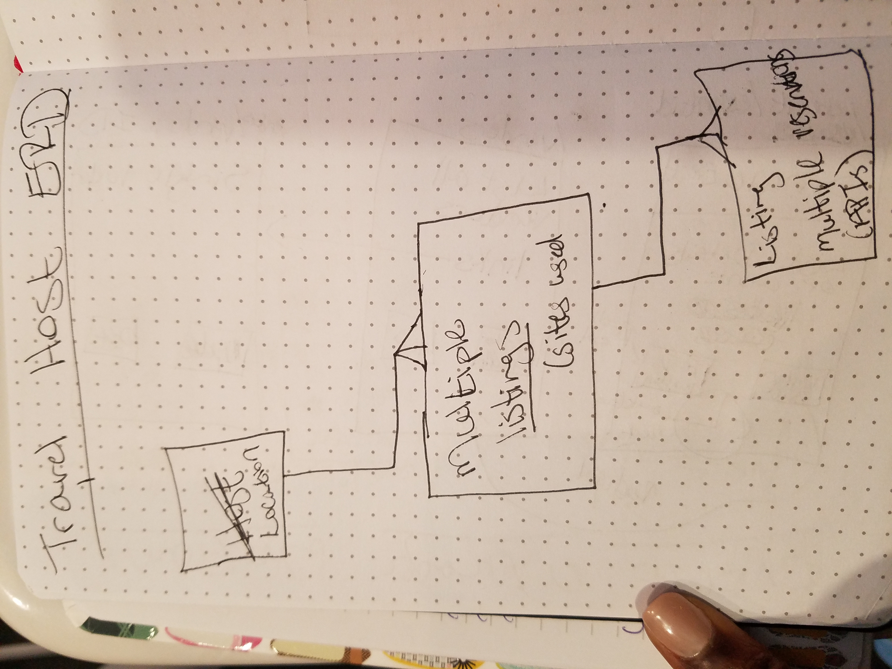

# Unit3Project
<h1>Hostess with the Mostess</h1>
<h1>Technologies Used</h1>
<ul>
Heroku,React, Node.js, Express, MongoDB, and  Mongoose.

<h1>Planning</h1>
Trello

<h1>My Links</h1>
https://trello.com/b/ONkbKbxi/travel-host-application

https://hostess-with-the-mostess.herokuapp.com/

<h1>About this Project</h1>
This is a website designed for users that list homes on rental sites such Air BnB. 

<h1>My Experience</h1>
During this project, I sometimes struggled on which step I should actually be focused. Success - I am becoming more confident in my ability to code with less guidance.  

<h1>Version 2</h1>
<ul>
I would like to add styling to all pages and incorporate a 3rd party API.  I would also like to toggle site details when you hover over the pictures.

